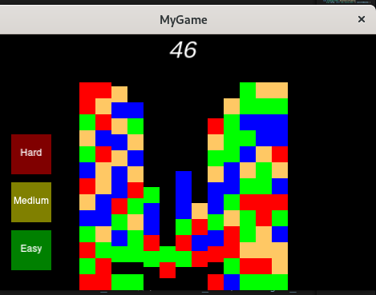
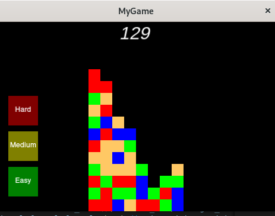

## Small game representing cocos2dx initial possibilities

**cocos2dx v4.0 used**

- for docs: https://docs.cocos.com/cocos2d-x/manual/en/
- API: https://docs.cocos2d-x.org/api-ref/index.html

- Just launch in terminal new game by: 
***cocos new FirstGame -l cpp -p com.mycompany.mygame -d Games/*** 
or similar 
and replace **Classes**, **Resources** and **CMakeLists.txt** by given data.
- Then launch ***cocos run -p your_system_alias***.
- Go through oficial documentation for details.
- Breadth first search (BFS) is used as main algorithms function. **Do not try to increase it**.

There is linux build binary in repository.